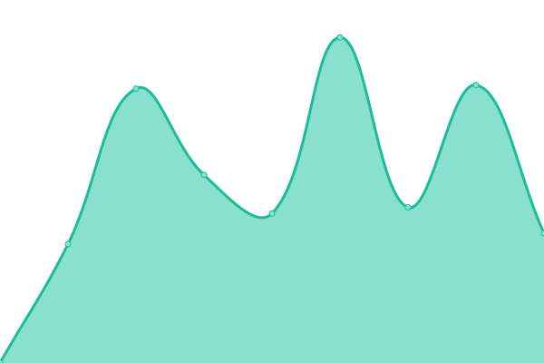

# [📈 Live Status](https://james-martinez.github.io/levelup): <!--live status--> **🟧 Partial outage**

This repository contains the open-source uptime monitor and status page for [James Martinez](https://james-martinez.github.io/levelup), powered by [Upptime](https://github.com/upptime/upptime).

With [Upptime](https://upptime.js.org), you can get your own unlimited and free uptime monitor and status page, powered entirely by a GitHub repository. We use [Issues](https://github.com/james-martinez/levelup/issues) as incident reports, [Actions](https://github.com/james-martinez/levelup/actions) as uptime monitors, and [Pages](https://james-martinez.github.io/levelup) for the status page.

<!--start: status pages-->
<!-- This summary is generated by Upptime (https://github.com/upptime/upptime) -->
<!-- Do not edit this manually, your changes will be overwritten -->
<!-- prettier-ignore -->
| URL | Status | History | Response Time | Uptime |
| --- | ------ | ------- | ------------- | ------ |
|  [Code](https://code.levelup.cce.af.mil) | 🟩 Up | [code.yml](https://github.com/james-martinez/levelup/commits/HEAD/history/code.yml) | 

 1037ms
     
 | 

<a href="https://james-martinez.github.io/levelup/history/code">100.00%</a>
    

|  [Chat](https://chat.levelup.cce.af.mil) | 🟩 Up | [chat.yml](https://github.com/james-martinez/levelup/commits/HEAD/history/chat.yml) | 

 683ms
     
 | 

<a href="https://james-martinez.github.io/levelup/history/chat">100.00%</a>
    

|  [Jira](https://jira.levelup.cce.af.mil) | 🟩 Up | [jira.yml](https://github.com/james-martinez/levelup/commits/HEAD/history/jira.yml) | 

 542ms
     
 | 

<a href="https://james-martinez.github.io/levelup/history/jira">100.00%</a>
    

|  [Confluence](https://confluence.levelup.cce.af.mil) | 🟥 Down | [confluence.yml](https://github.com/james-martinez/levelup/commits/HEAD/history/confluence.yml) | 

 2680ms
     
 | 

<a href="https://james-martinez.github.io/levelup/history/confluence">99.46%</a>
    

|  [Keycloak](https://keycloak.levelup.cce.af.mil/auth/realms/prod) | 🟩 Up | [keycloak.yml](https://github.com/james-martinez/levelup/commits/HEAD/history/keycloak.yml) | 

 146ms
     
 | 

<a href="https://james-martinez.github.io/levelup/history/keycloak">99.74%</a>
    

|  [NIPRGPT](https://chat.niprgpt.mil/) | 🟩 Up | [niprgpt.yml](https://github.com/james-martinez/levelup/commits/HEAD/history/niprgpt.yml) | 

 1027ms
     
 | 

<a href="https://james-martinez.github.io/levelup/history/niprgpt">100.00%</a>
    

|  [genai](https://genai.mil/) | 🟩 Up | [genai.yml](https://github.com/james-martinez/levelup/commits/HEAD/history/genai.yml) | 

 414ms
     
 | 

<a href="https://james-martinez.github.io/levelup/history/genai">100.00%</a>
    

<!--end: status pages-->

[**Visit our status website →**](https://james-martinez.github.io/levelup)

## 📄 License

- Powered by: [Upptime](https://github.com/upptime/upptime)
- Code: [MIT](./LICENSE) © [Anand Chowdhary](https://anandchowdhary.com), supported by [Pabio](https://pabio.com)
- Data in the `./history` directory: [Open Database License](https://opendatacommons.org/licenses/odbl/1-0/)
